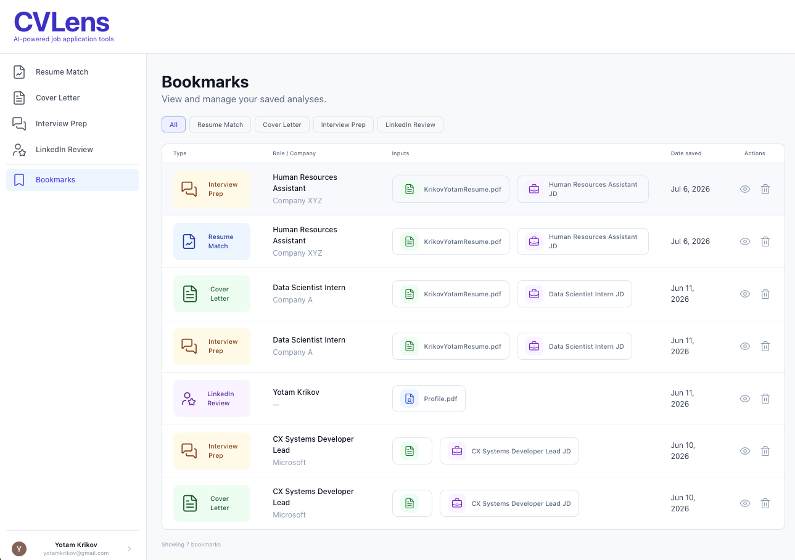
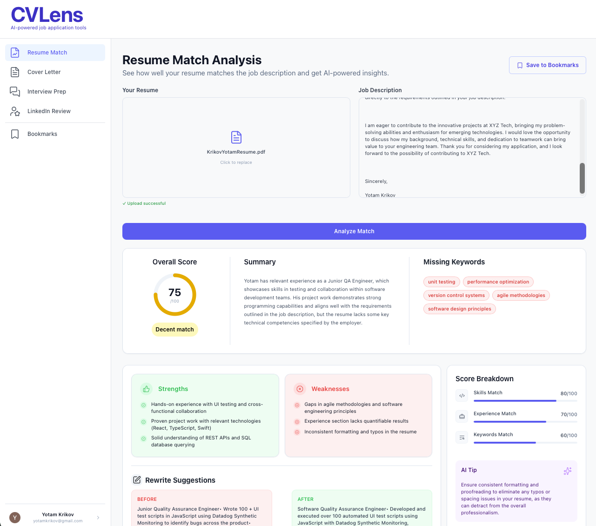
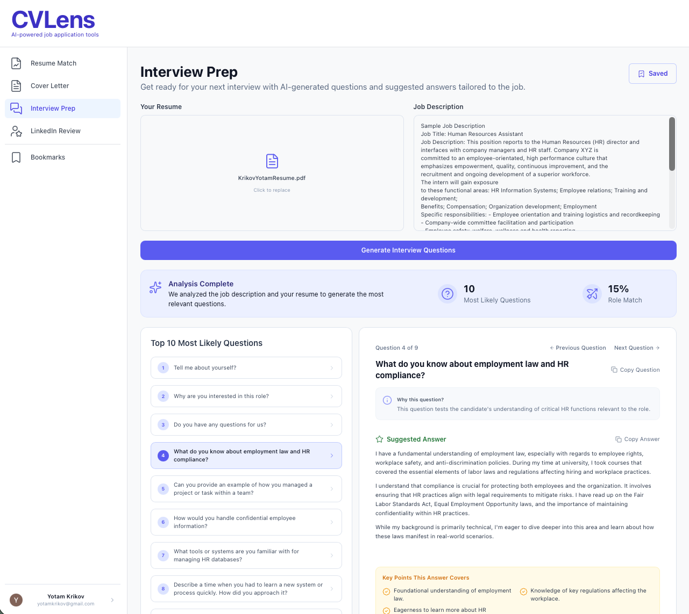
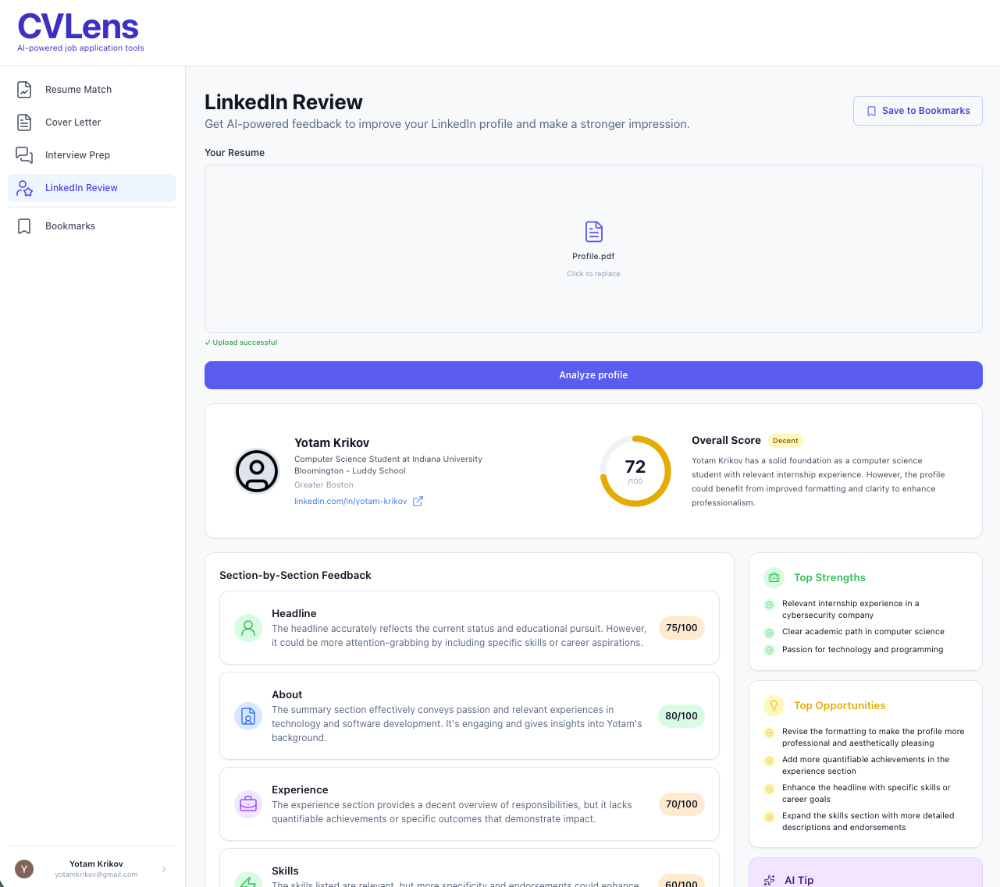
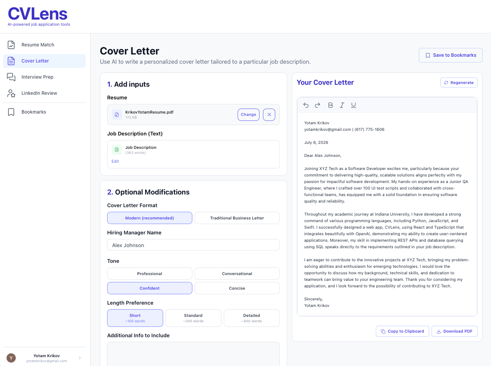

# CVLens
An AI-powered web app that helps job seekers at every stage of the application process — from resume analysis to cover letter generation, interview prep, and LinkedIn review.

**Live:** [cvlens-three.vercel.app](https://cvlens-three.vercel.app)

---

## Screenshots
<p align="center">
  
  
  
  
  
</p>

---

## Features

**Resume Match Analysis**
- Upload a resume as a PDF and paste any job description
- Get an overall match score (0–100) with a visual score ring
- Section-by-section breakdown (Skills, Experience, Keywords)
- Missing keywords, strengths, weaknesses, and an AI tip
- Before/after rewrite suggestions for full resume sections
- ATS compatibility indicators

**Cover Letter Generator**
- Upload resume and paste job description
- Supports Modern and Traditional Business Letter formats
- Optional customization: tone, length, hiring manager name, company address
- Rich text editor (TipTap) with bold, italic, underline, undo/redo
- Download as PDF, copy to clipboard, or regenerate

**Interview Prep**
- AI generates the top 10 most likely interview questions for the role
- Each question includes a suggested answer, why it's asked, and key points to cover
- Navigate between questions, copy answers, and track your readiness score

**LinkedIn Review**
- Upload your LinkedIn profile as a PDF
- Overall profile strength score
- Section-by-section scoring: Headline, About, Experience, Skills, Education
- Strengths, areas to improve, and actionable tips

**Bookmarks**
- Save any analysis or generated result to revisit later
- Filter by type (Resume Match, Cover Letter, Interview Prep, LinkedIn Review)
- View and delete saved sessions
- Load a bookmark back into the original tab to view the full result

---

## Tech Stack

| | |
|---|---|
| Frontend | React, TypeScript, Tailwind CSS |
| Rich Text Editor | TipTap |
| AI | OpenAI API (gpt-4o-mini) |
| Auth & Database | Supabase (Auth, PostgreSQL, RLS) |
| PDF Parsing | pdfjs-dist (client-side) |
| PDF Export | html2pdf.js |
| Backend | Vercel Serverless Functions |
| Deployment | Vercel |

---

## Running Locally

**Prerequisites:** Node.js, npm, Vercel CLI

```bash
git clone https://github.com/Yk231/CVLens.git
cd CVLens
npm install
```

Create a `.env` file:
```
OPENAI_API_KEY=your_key_here
REACT_APP_SUPABASE_URL=your_supabase_url
REACT_APP_SUPABASE_ANON_KEY=your_supabase_anon_key
```

Run locally:
```bash
vercel dev
```

Open `http://localhost:3000`

---

## Project Structure

```
CVLens/
├── api/
│   ├── analyze.ts          ← Resume match analysis endpoint
│   ├── coverLetter.ts      ← Cover letter generation endpoint
│   ├── interview.ts        ← Interview prep endpoint
│   ├── linkedin.ts         ← LinkedIn review endpoint
│   └── rewrite.ts          ← Resume rewrite endpoint
├── src/
│   ├── components/
│   │   ├── auth/           ← Auth components
│   │   ├── bookmarks/      ← BookmarkButton, InputSpan
│   │   ├── cover_letter/   ← Input, Output, Editor, Preview
│   │   ├── interview/      ← Interview prep components
│   │   ├── linkedin/       ← LinkedIn review components
│   │   ├── resume/         ← ScoreCard, StrengthsList, RewriteSuggestions, SectionBreakdown
│   │   ├── AnalyzeButton.tsx
│   │   ├── Header.tsx
│   │   ├── JobDescInput.tsx
│   │   └── ResumeInput.tsx
│   ├── context/
│   │   └── AppContext.tsx   ← Global state (session, active tab, bookmark data)
│   ├── lib/
│   │   ├── parsePdf.ts     ← Client-side PDF parsing
│   │   └── supabase.ts     ← Supabase client
│   ├── tabs/
│   │   ├── Bookmarks.tsx
│   │   ├── CoverLetter.tsx
│   │   ├── InterviewPrep.tsx
│   │   ├── LinkedInReview.tsx
│   │   ├── ProfilePage.tsx
│   │   └── ResumeMatch.tsx
│   ├── types/
│   │   ├── analysis.ts
│   │   ├── coverLetter.ts
│   │   ├── interview.ts
│   │   ├── linkedin.ts
│   │   └── rewrite.ts
│   └── App.tsx             ← Root component + sidebar navigation
└── .env                    ← API keys (not committed)
```

---

## Credits
Developed by [Yotam Krikov](https://github.com/Yk231)
