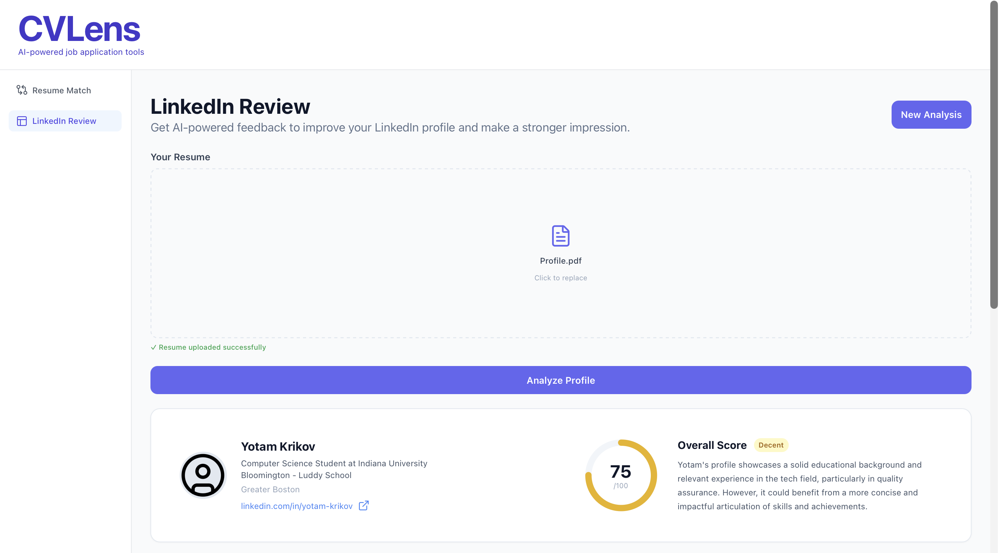
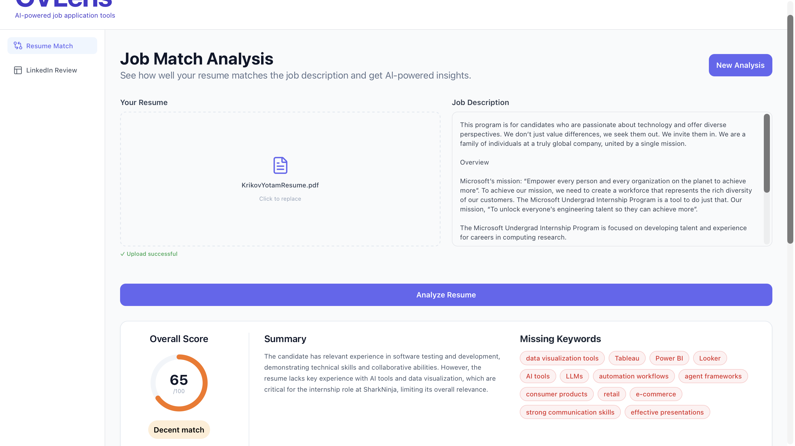
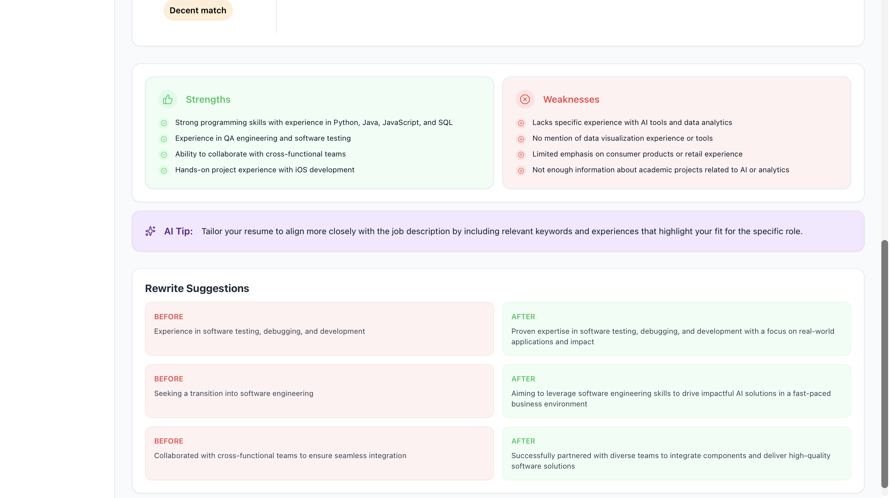

# CVLens

An AI-powered web app that analyzes resumes against job descriptions and reviews LinkedIn profiles — giving job seekers targeted, actionable feedback.

**Live:** [cvlens-three.vercel.app](https://cvlens-three.vercel.app)

---

## Screenshots

<p align="center">
  
  
  
  
</p>

---

## Features

**Resume Review**
- Upload a resume as a PDF
- Paste any job description to compare against
- Get an overall match score (0–100)
- See missing keywords, strengths, and weaknesses
- Receive specific before/after rewrite suggestions for resume bullets

**LinkedIn Review**
- Upload your LinkedIn profile as a PDF
- Get an overall profile strength score
- Section-by-section scoring for Headline, About, Experience, and Skills
- Strengths, areas to improve, and an AI tip

---

## Tech Stack

| | |
|---|---|
| Frontend | React, TypeScript, Tailwind CSS |
| AI | OpenAI API (gpt-4o-mini) |
| PDF Parsing | pdfjs-dist (client-side) |
| Backend | Vercel Serverless Functions |
| Deployment | Vercel |

---

## Running Locally

**Prerequisites:** Node.js, npm, Vercel CLI

```bash
git clone https://github.com/Yk231/CVLens.git
cd CVLens
npm install
```

Create a `.env` file:
```
OPENAI_API_KEY=your_key_here
```

Run locally:
```bash
vercel dev
```

Open `http://localhost:3000`

---

## Project Structure

```
CVLens/
├── api/
│   ├── analyze.ts        ← Resume analysis endpoint
│   └── linkedin.ts       ← LinkedIn analysis endpoint
├── src/
│   ├── components/
│   │   ├── resume/       ← Resume tab components
│   │   └── linkedin/     ← LinkedIn tab components
│   ├── tabs/
│   │   ├── ResumeReview.tsx    ← Resume tab compilation
│   │   └── LinkedInReview.tsx  ← LinkedIn tab compilation
│   ├── lib/
│   │   ├── analyze.ts    ← Resume API call
│   │   ├── linkedin.ts   ← LinkedIn API call
│   │   └── parsePdf.ts   ← Client-side PDF parsing
│   ├── types/
│   │   ├── analysis.ts   ← Resume result types
│   │   └── linkedin.ts   ← LinkedIn result types
│   └── App.tsx           ← Root component + sidebar
└── .env                  ← API keys (not committed)
```

---

## Credits

Developed by [Yotam Krikov](https://github.com/Yk231)